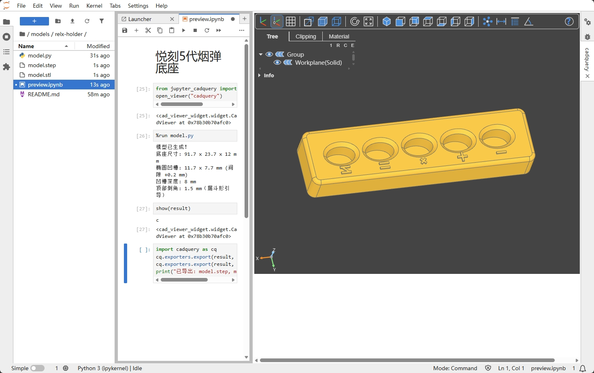

# cc-models 使用Claude建模

> "嘿 Claude，看看这张照片，帮我设计一个放它的支架，可容纳5个，自行搜索悦刻烟弹尺寸参数，每个插槽添加符号标识，顶面使用圆角"

| 输入 | | 输出 |
|:----:|:----:|:----:|
|  | **→** |  |

这不是程序员的玩具，这是建模的下一个时代 —— **Vibe CAD**。

拍张照片、说句话，AI 理解你的意图，检索相关参数，生成工业级参数化模型。不满意？继续对话调整，直到完美。基于 CadQuery/OpenCASCADE 内核，导出 STEP 可在 SolidWorks 继续编辑。

## 特点

- **文字描述生成模型**：向 AI 描述需求，自动生成 CadQuery 代码
- **增量修改**：查看效果后可以说"加宽 2mm"这样的增量调整
- **参数化设计**：所有尺寸以变量定义，易于调整
- **可编辑导出**：导出 STEP 格式，可在 SolidWorks/FreeCAD 中二次编辑
- **3D 打印就绪**：同时导出 STL 格式，可直接切片打印

## 环境搭建

```bash
# 创建虚拟环境
python3 -m venv venv
source venv/bin/activate

# 安装依赖（国内镜像）
PIP_INDEX_URL=https://mirrors.huaweicloud.com/repository/pypi/simple \
pip3 install cadquery-ocp cadquery jupyter-cadquery jupyterlab
```

## 项目结构

```
.
├── README.md
├── CLAUDE.md                    # AI 开发指南
├── venv/                        # Python 虚拟环境
└── models/                      # 模型目录（每个模型一个子目录）
    └── relx-holder/             # 示例：悦刻烟弹底座
        ├── README.md            # 模型说明（需求、参考资料）
        ├── model.py             # 模型代码
        └── preview.ipynb        # 模型预览（Jupyter）
```

## 使用方法

### 1. 创建新模型

```bash
mkdir -p models/my-new-model
cp -r models/relx-holder models/my-new-model
```

### 2. 预览模型

```bash
source venv/bin/activate
jupyter lab --ip=0.0.0.0 --port=3002 --no-browser --allow-root
```

打开 `preview.ipynb`，依次运行：
1. `open_viewer()` - 打开 3D 视图
2. `%run model.py` - 生成模型
3. `show(result)` - 预览
4. 导出 cell - 确认后导出 STEP/STL

## 导出格式

| 格式 | 用途 |
|------|------|
| `.step` | 可在 SolidWorks/FreeCAD 中编辑 |
| `.stl` | 直接用于 3D 打印切片 |

## 现有模型

- [悦刻烟弹底座](models/relx-holder/) - 桌面烟弹收纳座

## 开发

使用 AI 辅助开发时，参考 [CLAUDE.md](CLAUDE.md) 了解 CadQuery 开发经验。

## 参考

- [CadQuery 文档](https://cadquery.readthedocs.io/)
- [jupyter-cadquery](https://github.com/bernhard-42/jupyter-cadquery)

## 同类项目对比

| 对比项 | OpenSCAD | ClaudeCAD | CQAsk | cc-models |
|--------|----------|-----------|-------|-----------|
| 形式 | 桌面应用 + CLI | Web 应用 | 前后端分离 Web 应用 | 本地脚本 + Jupyter |
| 安装 | 安装包 | npm + API key | yarn + conda + 后端服务 | 单个 venv |
| 语言 | OpenSCAD DSL | - | Python | Python |
| CAD 内核 | CGAL（网格） | Three.js（网格） | OpenCASCADE（B-Rep） | OpenCASCADE（B-Rep） |
| STEP 导出 | ❌ 仅 STL/AMF/3MF | ❌ 仅 STL | ✅ | ✅ 可在 SolidWorks 二次编辑 |
| 圆角/倒角 | 需手动构造 | - | ✅ 内置 fillet/chamfer | ✅ 内置 fillet/chamfer |
